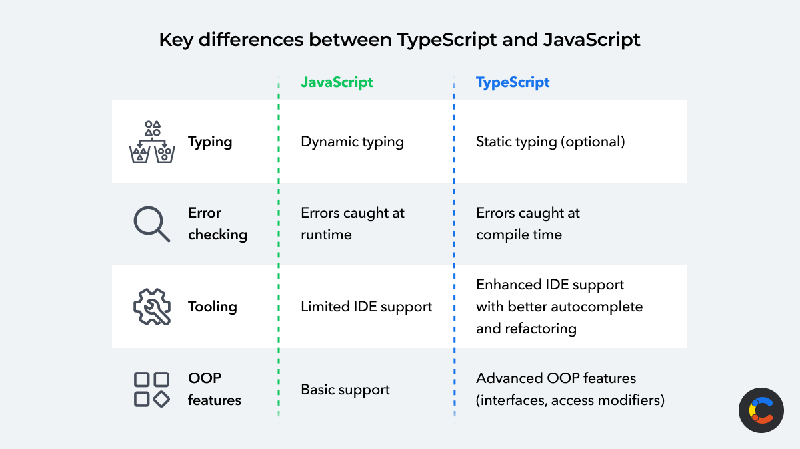
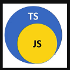

Typee Script ( Basics)
----------- ---------

1. Download Type Script
    npm install typescript --save-dev
    npm install -g typescript

2. Compile and Run 
    tsc <.ts> file // Compiles 
    node <js> file 

    

    
    
3. TSDEMO1
   print cmd on console.log
4. TS01 
    Data Types ( number & String )
5. What Type, Type Inteferance and Type Annotation ?
    a) (number,String,null, undefined)

    b) type Inteferance --> variables write with data type or without data type, at Compile time  applied based on the value. typeof() returnd data type 

    c) Type Annotation --> Explicitly defining type of variable

6. Arrays --> collection of similar type of data & dynamic nature (array.push)
7. Tuples --> fix size and order of elements matters 
8. additional data types ( any  void and never)
9. enum , union , assetion
10. If..else statement, ternary opration 
11. Switch case statement
12. Functions 
    a) delcare function --> name function

    b) fucntions using parameterized

    c) funtion with return data type 

    d) Anonymous fuynctions

    e) Anonymous fucntion with parameters

    f) Anonymous arrow functions 
    
13. Loop statement ( For, For..of for ..in , while and do..while)
14. Arrow Functions , Anonymous functions
15. Optional and Default params 
16. function overloading

